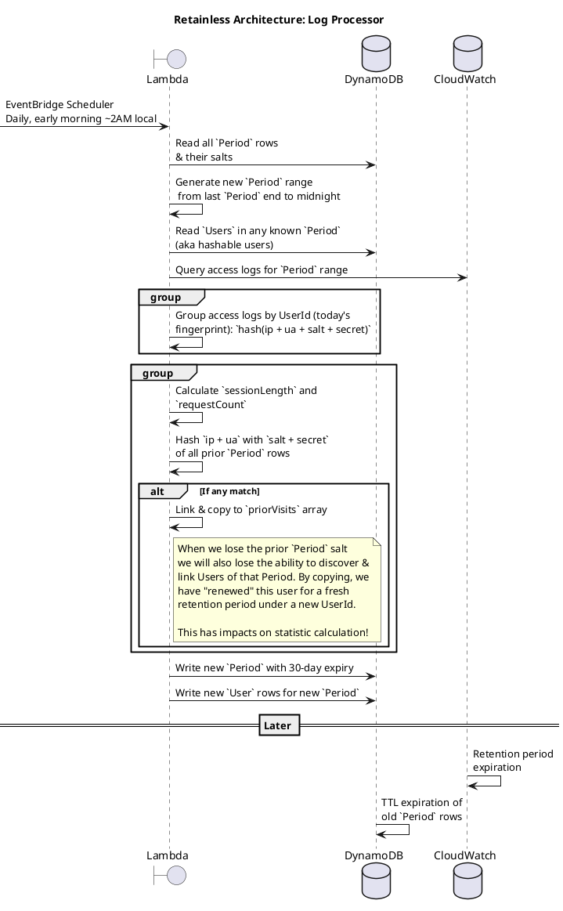

# Retainless

**Privacy-first app analytics that matter.**

Retainless is a sever-side analytics platform for measuring your app's success. Access logs never leave your cloud
account, and there is no tracking code and no cookies.

## retainless-collector

This code is the core gathering agent for Retainless, running in your cloud account that processes and stores data. It
can be deployed to [AWS](#install-aws) or [GCP](#install-gcp) and others coming soon, but
the [Architecture](#architecture)
is aligned between providers.

### Prepare

Your app must log access requests to *CloudWatch Logs* or *GCP Cloud Logging*. For services that sample requests, they
should be set to `100%` (all requests).

In general, we recommend a CDN, but cloud servers usually can be configured for managed logging.

The retention period must be at least `2 days`, but you may want longer log storage in case an error requires you to
reprocess access logs. Since access logs contain IP addresses, they are considered personal data, so shorter is better.

### Install

#### Install: AWS

Terraform:

```terraform
module "retainless" {
  source = "git::https://github.com/retainless/retainless-collector.git//aws/terraform"

  log_group_arn   = "arn:aws:logs:us-east-1:123456789876:log-group:/aws/cloudfront/cdn-prod-access-logs:*"
  log_stream_name = "CloudFront_EA123456789EEAA"
}
```

#### Install: GCP

Coming soon!

### Analyze

#### Analyze: CLI

```bash
# first:
echo '@retainless:registry=https://npm.pkg.github.com' >> ~/.npmrc
npm install -g @retainless/cli

# then:
retainless daily-churn --help
retainless --start 2025-10-01 --end 2025-10-31 daily-churn > ~/Documents/DailyChurn.csv
```

#### Analyze: Retainless Cloud

Sign up your team at [Retainless.com](https://www.retainless.com) for updates.

### Architecture

**Log Processor:**



**CLI (Statistics):**

The Retainless statistics system can seem complex at first, but understanding a few fundamental concepts can simplify
it:

1. **Session Storage**:  
   Sessions are saved as `UserId # Period` in the KV database. For privacy:
    - We avoid copying prior UserIds into priorVisits, to ensure visitors are anonymous.

2. **Visitors vs. Sessions**:  
   When querying a date range (e.g., `2025-10-06 to 2025-10-13`), each user visit in the range is treated as an
   independent session.
    - Example: A user visiting every day in the range will appear 7 times, unlinked between visits.

3. **Calculating Visitors**:
    - Each session tracks how many times the user visited before (e.g., their last visit will show 6 priorVisits, the
      previous session will show 5, etc.).
    - When counting metrics like *churn*, we count one user's 7 sessions as:
        - Add `+1` for each `UserId # Period`.
        - Subtract `-1` for all priorVisit periods to undo the previous row.

4. **Query Preparation**:
   To ensure accurate counts, queries include:
    - Periods between the `--start` and `--end` dates.
    - Any periods referenced by priorVisits.
      - Wit
        results.

## Thank you :)

If you know of ways to improve Retainless Architecture or code, please reach out or raise an Issue or PR!

-Hank
